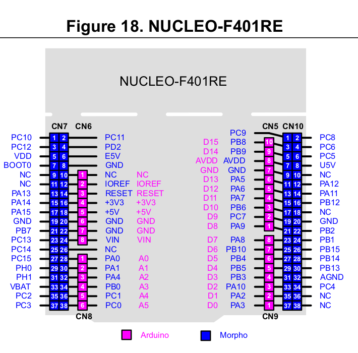

a line following robot using stm32F4 and implementing PID controller
## PINOUTs 

### PONT-H 
- IN1 PB5  (D4)	
- IN2 PB4  (D5)	
- IN3 PB1  (x)
- IN4 PB3  (D3)
- ENA PA0 : PWM_timer2_ch1 (A0)  
- ENB PA1 : PWM_timer2_ch2 (A1) 

### TCRT5000 sensor pin (5 pins INPUT ) 
- PIN_1 PB12 	=> S1 left 
- PIN_2 PB2     => S2 
- PIN_3 PB15    => S3 middle
- PIN_4 PB14    => S4 
- PIN_5 PA13 	=> S5 right  

## STM32F401-NUCLEO_PINOUTS

